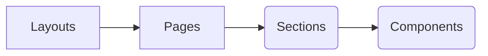

# Unlimitd Front-End

[](https://www.javascript.com)

### Technical overview

- [Material UI](https://mui.com/) provides robust & customizable UI library
- [NPM](https://www.npmjs.com/) manages dependencies.

### Global architecture



### Layouts

> **Note:** Find all layouts here: **src/layouts**

Layouts are elements common to several pages such as a menu, a navbar or a logo. They are usually used in `src/routes/index.js` to wrap one or more routes to give them a common layout.

Layouts always include an `<Outlet />` component which renders the child route's element, if there is one.

### Pages

> **Note:** Find all pages here: **src/pages**

Pages are the entry points for routes described in the `src/routes/index.js` file. These always include the `<Page />` component, which is responsible for giving the page a title.

### Sections

> **Note:** Find all sections here: **src/sections**

The sections folder contains the `business logic bricks` that can be reused in the application. They are made of Material UI native components and/or our own custom components in `src/components`

### Components

> **Note:** Find all components here: **src/components**

The components folder contains the `logical building blocks` that can be reused in the application.

We favour the use of `functional components` with the use of hooks and default exports at the end of the file.
We also use `propTypes` and `defaultProps` to manage props.

The use of components from the `material UI library` is strongly recommended with the optional use of `styled` for customisation of @mui/material/styles.

### Requesting system

> **Note:** Find all requests files here: **src/graphql**

Each entity has its own queries, mutations & subscriptions that allow it to interact with the API through [Apollo Client](https://www.apollographql.com/docs/react/).

The use of fragments is encouraged to factor the requested fields.

### Cache management:

The use of [Apollo-graphql cache](https://www.apollographql.com/docs/react/caching/overview/) is highly recommended to have a dynamic application without page reloads.

_Example, in the case of an update, the entire object will be returned so that the front end can autonomously update the data it has in its cache_

### Running the project locally

1. Make sure you are using at least a `nodeJS version >= 12`
2. Install dependencies with `npm install`
3. Run `npm start`

### Recommended development environment

It is recommended to use [vscode](https://code.visualstudio.com/download) with the following extensions:

1. [ESLint](https://marketplace.visualstudio.com/items?itemName=dbaeumer.vscode-eslint)
2. [Prettier](https://marketplace.visualstudio.com/items?itemName=esbenp.prettier-vscode)
3. [Spell Checker](https://marketplace.visualstudio.com/items?itemName=streetsidesoftware.code-spell-checker)

The project embeds this [vscode](https://code.visualstudio.com/download) configuration :

```json
{
  "editor.codeActionsOnSave": {
    "source.fixAll.eslint": true
  },
  "editor.formatOnSave": true,
  "eslint.validate": ["javascript", "json"]
}
```

1. Enable json eslint validation.
2. Auto fix eslint plugins rules on save.
